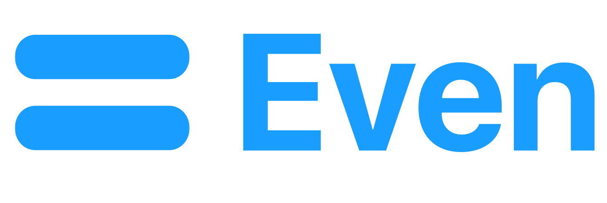

[![Contributors][contributors-shield]][contributors-url]
[![Forks][forks-shield]][forks-url]
[![Stargazers][stars-shield]][stars-url]
[![Issues][issues-shield]][issues-url]
[![MIT License][license-shield]][license-url]
[![LinkedIn][linkedin-shield]][linkedin-url]


<!-- PROJECT LOGO -->
<br />
<p align="center">
  <a href="https://github.com/MaurijnBesters/isEven/">
    
  </a>

  <h3 align="center">Best-iSeven Javascript library</h3>

  <p align="center">
    An awesome Javascript library to calculate even numbers in your projects!
    <br />
    <a href="https://github.com/MaurijnBesters/isEven/"><strong>Explore the docs »</strong></a>
    <br />
  </p>
</p>


<!-- TABLE OF CONTENTS -->
<details open="open">
  <summary>Table of Contents</summary>
  <ol>
    <li>
      <a href="#about-the-project">About The Project</a>
      <ul>
        <li><a href="#built-with">Built With</a></li>
      </ul>
    </li>
    <li>
      <a href="#getting-started">Getting Started</a>
      <ul>
        <li><a href="#prerequisites">Prerequisites</a></li>
        <li><a href="#installation">Installation</a></li>
      </ul>
    </li>
    <li><a href="#usage">Usage</a></li>
    <li><a href="#roadmap">Roadmap</a></li>
    <li><a href="#contributing">Contributing</a></li>
    <li><a href="#license">License</a></li>
    <li><a href="#contact">Contact</a></li>
    <li><a href="#acknowledgements">Acknowledgements</a></li>
  </ol>
</details>


<!-- ABOUT THE PROJECT -->
## About The Project

There are many great libraries to calculate even numbers available on GitHub, however, I didn't find one that really suit my needs so I created this enhanced one. I want to create a smart algorithm so amazing that it'll be the last one you ever need -- I think this is it.

Here's why:
* Your time should be focused on creating something amazing. A project that solves a problem and helps others
* You shouldn't be doing the same tasks over and over like creating a isEven method from scratch
* You should implement DRY principles to the rest of your life :smile:

You may also suggest changes by forking this repo and creating a pull request or opening an issue. Thanks to all the people have have contributed to expanding this template!

A list of commonly used resources that I find helpful are listed in the acknowledgements.

### Built With

* [Bootstrap](https://getbootstrap.com)
* [JQuery](https://jquery.com)
* [JavaScript](https://www.javascript.com/)


<!-- GETTING STARTED -->
## Getting Started

This is an example of how you can use this library to enhance your project.

### Prerequisites

This is an example of how to list things you need to use the software and how to install them.
* script injection
  ```html
  <script src="https://github.com/MaurijnBesters/isEven/main/isEven.js"></script>
  ```

### Installation

1. Clone the repo
   ```sh
   git clone https://github.com/MaurijnBesters/isEven.git
   ```

<!-- USAGE EXAMPLES -->
## Usage

To use this library you have to reference this library either by downloading the library and referencing it locally or referencing to this public git library
  
   ```html
  <script src="./isEven.js"></script>
  ```
  
  ```html
  <script src="https://github.com/MaurijnBesters/isEven/main/isEven.js"></script>
  ```
  
_For more examples, please refer to the [Documentation](https://github.com/MaurijnBesters/isEven)_


<!-- ROADMAP -->
## Roadmap

See the [open issues](https://github.com/MaurijnBesters/isEven) for a list of proposed features (and known issues).


<!-- CONTRIBUTING -->
## Contributing

Contributions are what make the open source community such an amazing place to be learn, inspire, and create. Any contributions you make are **greatly appreciated**.

1. Fork the Project
2. Create your Feature Branch (`git checkout -b feature/AmazingFeature`)
3. Commit your Changes (`git commit -m 'Add some AmazingFeature'`)
4. Push to the Branch (`git push origin feature/AmazingFeature`)
5. Open a Pull Request


<!-- LICENSE -->
## License

Distributed under the MIT License. See `LICENSE` for more information.


<!-- CONTACT -->
## Contact

Project Link: [https://github.com/MaurijnBesters/isEven](https://github.com/MaurijnBesters/isEven)


<!-- ACKNOWLEDGEMENTS -->
## Acknowledgements

* [Choose an Open Source License](https://choosealicense.com)
* [GitHub Pages](https://pages.github.com)


<!-- MARKDOWN LINKS & IMAGES -->
<!-- https://www.markdownguide.org/basic-syntax/#reference-style-links -->
[contributors-shield]: https://img.shields.io/github/contributors/othneildrew/Best-README-Template.svg?style=for-the-badge
[contributors-url]: https://github.com/othneildrew/Best-README-Template/graphs/contributors
[forks-shield]: https://img.shields.io/github/forks/othneildrew/Best-README-Template.svg?style=for-the-badge
[forks-url]: https://github.com/othneildrew/Best-README-Template/network/members
[stars-shield]: https://img.shields.io/github/stars/othneildrew/Best-README-Template.svg?style=for-the-badge
[stars-url]: https://github.com/othneildrew/Best-README-Template/stargazers
[issues-shield]: https://img.shields.io/github/issues/othneildrew/Best-README-Template.svg?style=for-the-badge
[issues-url]: https://github.com/othneildrew/Best-README-Template/issues
[license-shield]: https://img.shields.io/github/license/othneildrew/Best-README-Template.svg?style=for-the-badge
[license-url]: https://github.com/othneildrew/Best-README-Template/blob/master/LICENSE.txt
[linkedin-shield]: https://img.shields.io/badge/-LinkedIn-black.svg?style=for-the-badge&logo=linkedin&colorB=555
[linkedin-url]: https://linkedin.com/in/maurijnbesters
